<div align="center">



### A vault you lock *yourself* out of. A personal trading circuit breaker that kills revenge-trading.

[](https://iron-hands-pearl.vercel.app/)
[](https://testnet.monadexplorer.com/address/0xd6763ac55bdC8e7274Fc430B0EB7C4439d2c10e0)
[](https://monad.xyz)
[](LICENSE)


</div>

> I've blown funded trading accounts to revenge-trading. Not bad analysis — the 2am
> urge to win it back *right now*. So I built the contract that won't let me.
> Deployed live on Monad testnet · [deploy tx](https://testnet.monadexplorer.com/tx/0xffead9900531ec02c63149110b82473fa3af6d766827bc41b5af3e825c4eb993)

## Why

Revenge-trading after a loss blows more accounts than any bad thesis ever did. The
urge hits hardest right after a loss, at 2am, when willpower is lowest. Every soft
fix — "just close the app", "use a cold wallet" — fails because you can always undo
it in the moment.

**Iron Hands** removes the undo. It's a Ulysses pact as a smart contract, built on one
asymmetry enforced on-chain:

> You can **always** push your unlock time further out.
> You can **never** pull it closer.

No owner. No admin. No pause. No upgrade. No rescue function. When you're tilting and
go to yank your MON for a revenge trade, the withdrawal **reverts**. That revert is
the product — present-you binds future-you, and the chain refuses to let you untie
the knot early.

## Architecture

```
        ┌──────────────┐   deposit · lock · withdraw    ┌────────────────────────┐
        │  your wallet │ ────────────────────────────►  │  IronHands.sol         │
        │  (MetaMask/  │                                 │  Monad testnet (10143) │
        │   Rabby)     │  ◄──── StillLocked  revert ───  │  no owner · immutable  │
        └──────┬───────┘                                 └────────────────────────┘
               │  reads vaultOf / timeRemaining
        ┌──────▼───────┐
        │  index.html  │   static · ethers v6 · no backend · no build step
        │  breaker UI  │   GREEN open  ·  RED locked + live countdown
        └──────────────┘
```

## Stack

| Layer     | Choice                                                        |
|-----------|---------------------------------------------------------------|
| Contract  | Solidity 0.8.24 · Foundry · zero external dependencies        |
| Chain     | Monad testnet · chainId 10143                                 |
| Frontend  | single-file `index.html` · ethers v6 · no framework, no build |
| Tests     | Foundry · 9/9 passing                                         |

## Flow

1. **Deposit** MON into your own vault.
2. **Engage the breaker** — pick a cooldown (1h / 24h / 7d / 30d). The dial flips RED and a live countdown starts.
3. **Try to withdraw while locked** → the tx reverts with `StillLocked`. You can watch it fail in the explorer.
4. **Wait it out.** Once the timer clears, the dial goes GREEN and withdrawals work again. The only way out is through.

## The contract

The whole product is one check. You can extend a lock; you can never shorten it.

```solidity
function lock(uint64 duration) external {
    if (duration == 0) revert ZeroDuration();
    Vault storage v = _vaults[msg.sender];
    uint64 newUntil = uint64(block.timestamp) + duration;
    if (newUntil <= v.lockedUntil) revert WouldShortenLock(v.lockedUntil); // one-way only
    v.lockedUntil = newUntil;
    emit Locked(msg.sender, newUntil);
}

function withdraw(uint256 amount) external nonReentrant {
    if (amount == 0) revert AmountZero();
    Vault storage v = _vaults[msg.sender];
    if (block.timestamp < v.lockedUntil) revert StillLocked(v.lockedUntil); // the feature
    ...
}
```

No `onlyOwner`, no mutable admin, no `selfdestruct`. ~120 lines. The deployer has no more
power over your vault than a stranger does.

## Local dev

```bash
forge install foundry-rs/forge-std --no-git
forge test -vv            # 9 passing
```

## Deploy

```bash
forge create src/IronHands.sol:IronHands \
  --rpc-url https://testnet-rpc.monad.xyz \
  --interactive --broadcast
# paste the printed address into web/index.html (CONTRACT_ADDRESS), then host web/
```

| | |
|---|---|
| Chain ID | 10143 (0x279f) |
| RPC | https://testnet-rpc.monad.xyz |
| Explorer | https://testnet.monadexplorer.com |
| Faucet | https://faucet.monad.xyz |

## Attribution

Built solo by [makabeez](https://github.com/Makabeez) for the
[Spark](https://buildanything.so/hackathons/spark) hackathon on Monad — *build anything
onchain that solves a personal problem.* This one solves mine.

## License

MIT — see [LICENSE](LICENSE).
